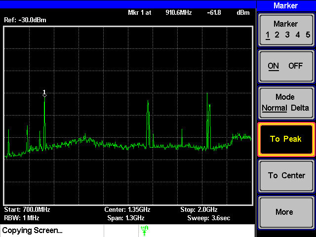
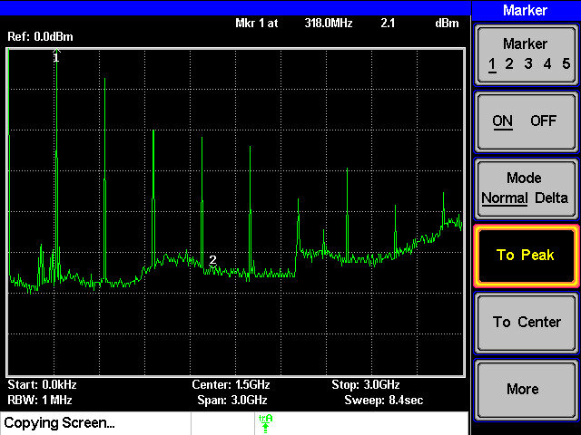
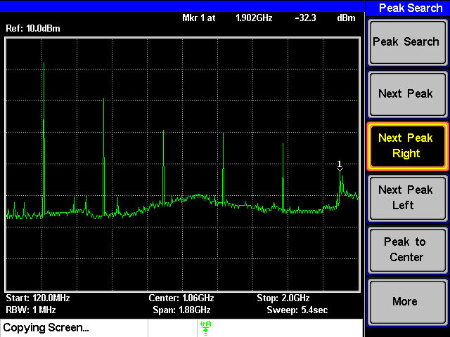
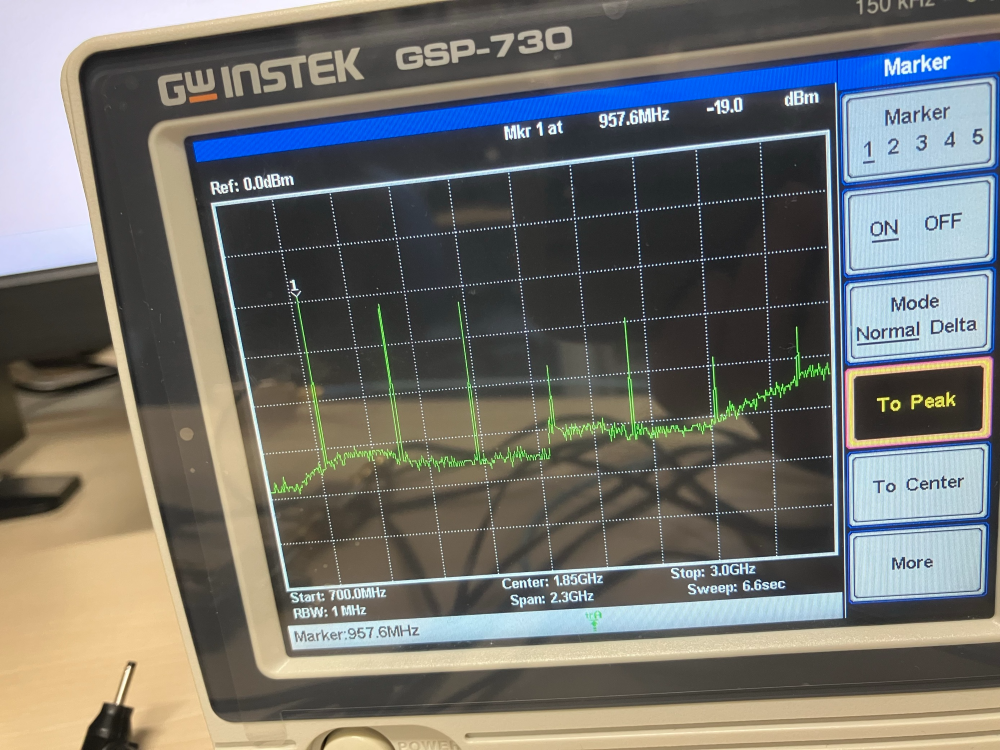
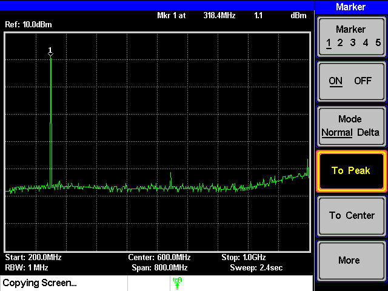
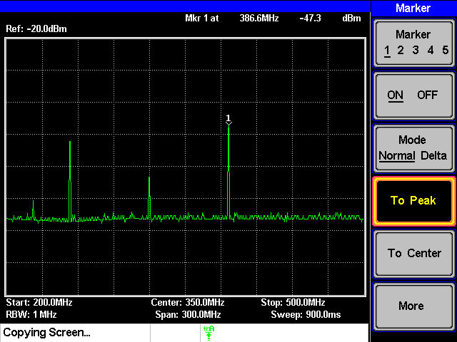
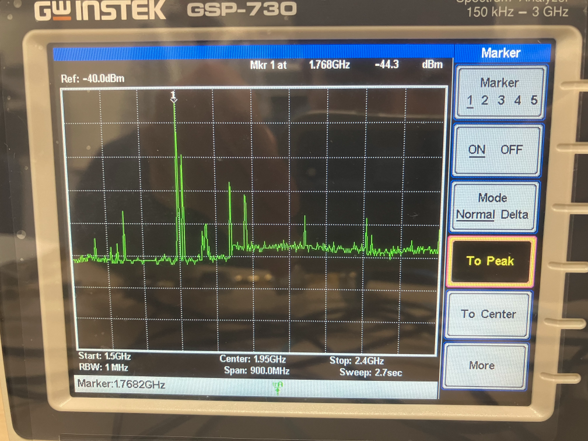

# AM 変調送受信の実験
### 
3I38 松井三吉

### 共同実験者
3I08 井上高志 3I18 地主藍里 3I28 八田晃成
## 目的
AM 変調の送受信実験を通じて，高周波機器および計測器の取り扱いについて学ぶ．

## 課題
### 4-1．各自が使用している携帯電話の使用周波数を，スペクトラム・アナライザを用いて確認せよ（結果は，周波数のみ示せばよい）．

#### 手順
(1) スペクトラム・アナライザ（以下，スペアナと呼ぶ）の Port1 に同軸ケーブルを介してアンテナ（ANT2000）
を取り付ける．  
同軸ケーブルにアンテナを取り付ける際には，アンテナ側のコネクタを回さずに，ケーブル側の
コネクタを必ず回すこと（ほかのものを取り付ける際にも，断線を防ぐため，アンテナを含むプローブ側のコネ
クタは回さないこと）．  

(2) スペアナの設定は，最初は次の通りにする（その後周波数範囲を狭めていく）．  
・Start frequency: 700 MHz  
・Stop frequency: 2GHz  
・Others: Auto settings     

(3) 携帯電話を発信してみる．スペアナの画面にスペクトルが出たら，その周波数を読み取る．  

(4) 読み取った周周波数をメモする（波形表示画面のスクリーンショット（ハードコピー）も取っておくといい）．
#### 結果  
910.6Hz  

考察  
ソフトバンクのバンド帯が900MHｚ帯があったのでソフトバンク回線同士の通信なので正確だと考える。

[参考](https://teppeilog.com/japan_mobile_bands/#:~:text=%E3%83%90%E3%83%B3%E3%83%89%E3%81%A7%E3%82%82%E3%81%82%E3%82%8A%E3%81%BE%E3%81%99%E3%80%82-,%E3%82%BD%E3%83%95%E3%83%88%E3%83%90%E3%83%B3%E3%82%AF%E3%81%AE%E3%83%AD%E3%83%BC%E3%83%90%E3%83%B3%E3%83%89%EF%BC%9A2.0GHz%E5%B8%AF(%E3%83%90%E3%83%B3%E3%83%891)%E3%80%81,%E3%82%B5%E3%83%BC%E3%83%93%E3%82%B9%E3%81%8C%E5%81%9C%E6%AD%A2%E3%81%97%E3%81%BE%E3%81%99%E3%80%82)
### ．信号発生器（XCO0320）の出力波形の周波数スペクトルおよび，それにバンドパスフィルタ（BPF0320）を付けた場合の出力を，スペアナで観測する

#### 手順
(1) 信号発生器（XCO0320）の出力部を同軸ケーブルを介してスペアナに接続する．  
(2) スペアナで，周波数スペクトルを確認する．  
(3) 所望の周波数のスペクトル以外に，高調波が出ていることを確認し（画面のハードコピーを取る），それらの
周波数を読み取り，記録すること．（ピークサーチ機能を用いるとよい．）  
＊最初は，観測周波数の幅を広く取り（Full span でもよい），スペクトルの大まかな特徴を確認の上，見たい部
分のみ拡大する（start および stop 周波数を変更する）．  
(4) 次に，バンドパスフィルタを信号発生器に接続し，同様に観測する．  
＊(3)および(4)に関して，所望波のスペクトルと，高調波（のいくつか）が入った画像データを保存すること．  

#### 結果

XCO0320のみ   
周波数スペクトル　318MHz  

高調波  

639.2MHz  

957.6MHz  

BPF0320を追加  
318.4MHz  

 
BFP0320を追加すると高調波がなくなり、必要な周波数が抽出された。  

考察  
このように高調波がなくなった理由は
バンドパス・フィルタが特定の範囲の周波数だけを通過させ、それよりも低域または高域の周波数成分を遮断（減衰）させるフィルタであり、2つのカットオフ周波数の間の周波数だけを通過させ、両カットオフ周波数の外側の周波数を減衰させたためであると考えられる。

[参考資料](https://www.analog.com/jp/resources/analog-dialogue/studentzone/studentzone-december-2018.html#:~:text=%E8%83%8C%E6%99%AF,%E5%91%A8%E6%B3%A2%E6%95%B0%E3%82%92%E6%B8%9B%E8%A1%B0%E3%81%95%E3%81%9B%E3%81%BE%E3%81%99%E3%80%82)

### 4-3．一段目のミキサ（MIX0400u）までを組み立て，その出力の周波数スペクトルをスペアナで観測せよ．
#### 手順　4‐2と同様に計測　但し高調波は不要
#### 結果
386.6MHz  

考察  
ほぼ理論値の値になっていたため追加した分が増えたと考えれる

### 4-4．送信側のモジュールを完成させ，スペアナでアンテナからの送信波の周波数スペクトルを確認せよ．
#### 手順　同様にする
#### 結果
1768MHz  

考察  
取扱説明書を見ていると理論値との差が出たが通信自体が弱くなっているので差が出ると考える。

### 4-5．AM 変調の送受信実験を行う．
#### 手順
(1) 受信側のモジュールを組み立てる．復調モジュールの出力には，ヘッドホンを付けておく．  
(2) 音声信号（スマホなどから音楽等）を，送信側に入力する．  
(3) 受信側のヘッドホンから音声が聞こえれば成功．  
#### 結果
音楽が聞こえたがノイズがすごかった。またアンテナを近づけてもノイズが出ていたが音量を下げるとよくなった。

### 感想
今回の実験でＡＭ変調の中身をある程度、理解することができました。また仕組みはよく理解できなかったけどモジュールを使うと音楽を聴くことができて面白いと感じました。